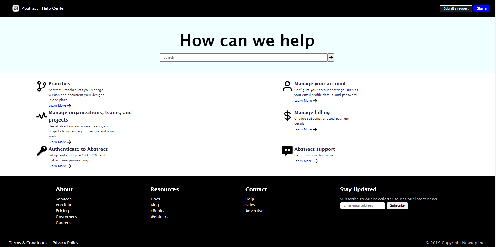
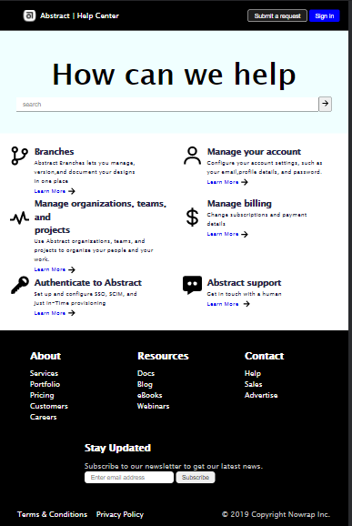

# Get Help Landing Page

This is a **Get Help Landing Page** designed to provide users with quick access to various resources, account management options, and support services. The page includes a header, a search section, a content section with multiple cards, and a footer with additional links and social media icons.

## Features
- **Header**: Includes a logo, navigation buttons, and a title.
- **Search Section**: Allows users to search for help topics.
- **Content Section**: Displays multiple cards with icons, headings, and descriptions for different help topics.
- **Footer**: Contains links to resources, social media icons, and legal information.

## Technologies Used
- **HTML5**: For the structure of the page.
- **CSS3**: For styling and layout.
- **Font Awesome**: For social media icons in the footer.

## Current Status
- The page is **responsive on PCs and tablets**.
- **Mobile responsiveness is yet to be implemented.**

## How to Use
1. Clone or download the repository.
2. Open the help.html file in your browser to view the page.
3. Explore the header, search bar, content cards, and footer.

## Future Improvements
- Add **mobile responsiveness** to ensure the page works seamlessly on smaller screens.
- Enhance the design with animations and transitions.
- Optimize the layout for faster loading.

## Screenshots
### Desktop View

### Tablet View

---

Feel free to contribute or provide feedback to improve this project!
